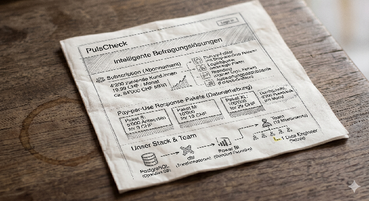

**Stand:** September 2026 · **Autor:** Datapeople Datenredaktion · **Lesedauer:** ca. 18 Minuten

**Hinweis zur Fallstudie:** Das im Folgenden beschriebene Unternehmen „PulsCheck AG" ist ein zusammengesetztes Beispiel, das auf wiederkehrenden Mustern aus realen Schweizer KMU-Projekten basiert. Geschäftsmodell, Datenstruktur, Code und Ergebnisse sind plausibel und nachvollziehbar, aber bewusst nicht einer einzelnen Kundin zugeordnet, um Vertraulichkeit zu wahren.

**Tools, die in diesem Beitrag verwendet werden:** [Evidence](https://github.com/evidence-dev/evidence) als Open-Source Dashboard-Framework (MIT-Lizenz), [Claude](https://claude.com) für die Code-Generierung, [DuckDB](https://duckdb.org/) als analytische Engine. Vergleichspunkte: Tableau, Looker, Microsoft Power BI.

**Das Ergebnis dieser Fallstudie läuft live:** Die drei gebauten Dashboards können Sie direkt unter [pulscheck-dashboards.fly.dev](https://pulscheck-dashboards.fly.dev/) anschauen – inklusive der im Beitrag beschriebenen Konventionen und Zahlen.

## TL;DR

Klassische Dashboard-Tools wie Tableau, Looker oder Power BI verlangen Klick-Spezialwissen, regelmässige externe Beratung und vier- bis fünfstellige Lizenzkosten – für ein Reporting-Bedürfnis, das sich heute mit weniger Aufwand lösen lässt. Dieser Beitrag zeigt am konkreten Beispiel der Schweizer Survey-SaaS-Firma PulsCheck AG, wie Sie mit dem Open-Source-Tool **Evidence** und einem LLM (in unserem Fall Claude) drei produktive Dashboards bauen, ohne ein einziges GUI zu öffnen. Die These des Beitrags ist klar: **Wer Agentic BI für Ad-hoc-Fragen einsetzt und Agentic Dashboards für wiederkehrende Reports, braucht kein klassisches BI-Tool mehr.** Wir untermauern das mit Code, Zahlen und einer ehrlichen Einordnung der Grenzen dieser Lösung.

## Warum Dashboards heute zu teuer sind

Es gibt ein wiederkehrendes Muster in Schweizer KMU-Datenprojekten: Eine Geschäftsleitung möchte Reports. IT oder ein Data Analyst beginnt mit Tableau, Looker oder Power BI. Nach drei Monaten ist klar, dass das Selbst-Bauen länger dauert als erwartet, also wird eine externe Tableau-Beratung beauftragt. Diese baut zehn schöne Dashboards. Sechs Monate später passt die Hälfte nicht mehr, weil sich Datenquellen oder Geschäftsregeln verändert haben. Die Beratung kommt zurück. Und wieder. Und wieder.

Das ist nicht zwingend so. Theoretisch können diese Dashboards auch intern entwickelt und gepflegt werden – das ist sogar oft die saubere Lösung. In der Praxis ist die interne Velocity bei klassischen BI-Tools allerdings einfach zu langsam: Eine Anpassung, die in der Sitzung beschlossen wurde, dauert zwei Wochen statt zwei Stunden, weil der eine Tableau-versierte Mensch im Team gerade an drei anderen Themen sitzt. So entstehen die Beratungs-Eskalationen, nicht weil das Inhouse-Modell falsch wäre, sondern weil das Tooling es ausbremst.

**Das Klick-Problem.** Tableau, Power BI und Looker haben hochkomplexe GUIs, die Spezialwissen erfordern. Es gibt Tableau-Berater:innen mit Tagessätzen zwischen CHF 1'500 und 2'500, die genau dieses Klick-Wissen verkaufen. Nichts gegen das Geschäftsmodell – aber für ein KMU mit fünf bis fünfzehn Reports ist das ein steiles Preisschild für ein Bedienproblem.

Der grössere Folgeschaden liegt auf der Recruiting-Seite. Wer Analyst:innen sucht, weil „wir Power BI machen" oder „wir sind ein Tableau-Shop", optimiert auf das falsche Profil. Was Schweizer KMU brauchen, sind Menschen, die geschäftlich denken, sauber SQL schreiben, Datenmodelle verstehen und mit dem jeweils geeignetsten Werkzeug arbeiten. Toolagnostisch, nicht plattformreligiös. Wer Stellen ausschreibt, die ein bestimmtes BI-Tool zur Voraussetzung machen, schliesst genau die Talente aus, die in zwei Jahren mit dem nächsten Werkzeug genauso produktiv wären – und holt sich stattdessen Spezialwissen, das mit dem Tool wieder veraltet.

**Versionierung und Übertragbarkeit.** Ein Tableau-Workbook ist ein binäres .twbx-File. Diff, Pull Request, Code Review, Branch-Merge – alles, was in der Software-Entwicklung seit zwanzig Jahren Standard ist – funktioniert hier nur sehr eingeschränkt. Wenn zwei Analyst:innen am selben Dashboard arbeiten, überschreibt eine die Arbeit der anderen. Das ist 2026 nicht mehr zeitgemäss.

**Definitionen driften.** Ohne expliziten Semantic Layer rechnet jedes Dashboard seinen eigenen Umsatz. „Aktiver Kunde" heisst im Sales-Dashboard eine andere Definition als im Operations-Dashboard. Der Streit darüber, welche Zahl in der Vorstandssitzung stimmt, ist wöchentlicher Standard.

**Die Lizenzkostenrechnung kommt obendrauf.** Aktuelle Listenpreise von Tableau Cloud Standard: Creator USD 75/Monat, Explorer USD 42/Monat, Viewer USD 15/Monat – jeweils jährlich. Tableau Cloud Enterprise erhöht auf USD 115 / 70 / 35. Looker startet bei USD 5'000/Monat. Power BI Pro bei USD 10/User/Monat plus die nötigen Microsoft-365-Lizenzen.

Die Lizenz ist ohnehin nur die sichtbare Spitze. Wer intern entwickelt, zahlt einen vollen FTE für Setup, Betrieb und Anpassung – in der Schweiz schnell CHF 120'000 bis 160'000 pro Jahr für eine BI-Engineer-Rolle, plus Lohnnebenkosten. Wer extern beauftragt, zahlt die oben erwähnten Tagessätze über das Jahr aufaddiert. In beiden Fällen entstehen die wahren Kosten nicht beim Lizenz-Klick, sondern bei der Arbeitsstunde, die in das Tool fliesst – und die fliesst bei klassischen BI-Plattformen reichlich.

Das Ganze ist nicht falsch. Es ist nur disproportional teuer für das, was die meisten Schweizer KMU tatsächlich brauchen: ein paar saubere, regelmässig aktualisierte Reports.

## Der Code-Only-Ausweg – und warum er Business-User überfordert

Es gibt seit Jahren eine Gegenbewegung: Mode, Hex, Jupyter Notebooks, Streamlit. Reports als Code, vollständig versionierbar, reproduzierbar, ohne Lock-in. Datapeople hat solche Setups bei mehreren Kunden eingeführt und kennt deren Stärken: Code-Reviews funktionieren, Änderungen sind nachvollziehbar, Lizenzkosten oft minimal.

Der Haken ist nur: Die Geschäftsleitung liest keine Notebooks. Ein CFO öffnet keine .ipynb-Datei. Ein:e Founder:in scrollt nicht durch eine Streamlit-Seite mit Code-Cells. Der Code-Only-Ansatz löst das Versionierungs-Problem, schafft aber ein Kommunikations-Problem zurück.

Vor dem aktuellen LLM-Sprung mussten Datenteams sich entscheiden: GUI-Komfort für Endnutzer:innen (Tableau & Co., teuer und schwer zu pflegen) oder Code-Disziplin für die Engineers (technisch sauber, kommt aber nicht im Business an). Diese Entscheidung muss heute nicht mehr getroffen werden.

## Die agentische Alternative in zwei Hälften

Die produktive Antwort auf das Dashboard-Problem ist zweigeteilt – und genau das ist der Punkt.

**Hälfte 1 – Ad-hoc-Fragen lösen Sie mit Agentic BI.** In unserem [vorhergehenden Beitrag zu Agentic BI mit nao](/blog/agentic-bi-für-kmu-in-der-praxis_-ein-schweizer-saas-fall-mit-nao/) haben wir gezeigt, wie ein KI-Agent natürliche Geschäftsfragen direkt beantwortet: „Wie viele DACH-Kund:innen haben im April XL-Pakete gekauft?" → SQL-Generierung → Antwort mit Datenherkunft → in Slack zugestellt. Die Stärke dieses Setups ist die Geschwindigkeit auf einmaligen Fragen und die Nähe zum operativen Geschäft.

Die Schwäche: Diese Antworten sind flüchtig. Sie leben im Chat-Verlauf, werden vergessen, und niemand baut auf ihnen auf. Vieles, was im Slack als Frage auftaucht, wäre eigentlich eine wiederkehrende Kennzahl, die ein Dashboard verdient.

**Hälfte 2 – Wiederkehrende Reports bauen Sie mit Agentic Dashboards.** Statt jede Woche dieselbe MRR-Frage neu zu stellen, kuratieren Sie die wichtigen Sichten in einem dauerhaft verfügbaren Dashboard. Statt es per Klick in Tableau zu bauen, lassen Sie es vom LLM als Code generieren, in Git versionieren, automatisch deployen.

Diese Trennung ist wichtig. Chat-Antworten sind wegwerfartig – das ist ihre Stärke. Dashboards leben weiter – das ist ihre Stärke. Klassische BI-Tools versuchen, beides in einer Plattform abzubilden, und werden dadurch teuer, komplex und schwer zu pflegen. Wer beide Bedürfnisse separat mit den jeweils geeigneten Werkzeugen löst, kommt mit deutlich weniger Tooling aus.

**Das schöne Zwischenspiel: vom Chat zum Dashboard.** Beide Hälften sind nicht starr getrennt – sie speisen einander. Wenn Sie die Anfragen an den nao-Agenten loggen (was nao mit Bordmitteln tut), sehen Sie nach wenigen Wochen, welche Fragen wiederkehren. „Wie hoch ist der MRR?", „Wie viele DACH-Subscriber haben XL gekauft?", „Wie ist die Sprachverteilung der Antworten?" – wenn dieselbe Frage in vier Wochen siebenmal gestellt wird, ist sie kein Ad-hoc-Bedürfnis mehr. Sie ist ein Kandidat für ein Dashboard, der ein für alle Mal dort leben kann. So entsteht aus dem Chat-Verlauf eine empirische Anforderungsliste für die Evidence-Pages, ohne dass jemand spekulieren muss, was die Geschäftsleitung „eigentlich" sehen möchte.

## Warum Evidence

[Evidence](https://github.com/evidence-dev/evidence) ist ein Open-Source-Framework für „BI-as-Code". Die Idee in einem Satz: Ein Dashboard ist eine Markdown-Datei mit eingebettetem SQL und visualisierenden Komponenten, die zu einer statischen Website kompiliert wird.

Konkret sieht eine Evidence-Page so aus:

````markdown
---
title: Subscription Health
---

# Subscription Health

Aktueller MRR über die letzten 12 Monate.

```sql mrr_history
select
  date_trunc('month', invoiced_at) as month,
  round(sum(amount_chf), 2) as mrr_chf
from pulscheck.invoices
where invoice_type = 'subscription'
  and status = 'paid'
group by 1
order by 1
```

<LineChart
  data={mrr_history}
  x=month
  y=mrr_chf
  title="MRR-Verlauf (CHF)"
  yFmt="#,##0"
/>
````

Das war das ganze Dashboard. Markdown, SQL, eine Komponente. Versionierbar, reviewbar, pull-requestbar.

**Architektur in einem Satz:** dbt + Warehouse → DuckDB als analytische Engine → Evidence-Build (Markdown + SQL → Static Site) → Hosting auf Fly.io, Cloudflare Pages, Vercel oder einem eigenen Reverse-Proxy. Niemand braucht eine Live-Verbindung zur Datenbank, wenn die Page aufgerufen wird – die Daten liegen schon präkompiliert vor. Das macht Evidence schnell und billig zu hosten.

DuckDB als Engine ist [von Evidence nativ unterstützt](https://docs.evidence.dev/core-concepts/data-sources/duckdb) und passt damit nahtlos zu unserem bestehenden Setup aus dem nao-Beitrag. Beide Tools – Evidence und nao – können dieselbe .duckdb-Datei lesen, was den operativen Aufwand minimal hält.

## Wo Evidence ehrlich an seine Grenzen kommt

Evidence ist keine Wunderwaffe. Eine faire Auflistung der Schwächen, basierend auf der [Vergleichsanalyse von Holistics](https://www.holistics.io/blog/business-intelligence-bi-tools/) und der [Evidence-Doku](https://docs.evidence.dev) selbst:

- **Statisches Output.** Endnutzer:innen können nicht ad-hoc drillen, pivotieren oder neue Dimensionen aufschneiden – nur das, was als Filter explizit gebaut wurde, ist interaktiv. Wer ein neues Schnittmuster will, ändert den Code.

- **Visualisierungen weniger reichhaltig** als bei Tableau oder Power BI. Standard-Charts sind sauber, aber spezielle Visualisierungen (Sankey-Diagramme, komplexe Geo-Heatmaps, animierte Flow-Diagramme) brauchen Custom Components in Svelte.

- **Keine Row-Level-Security im Open-Source-Kern.** Wer pro Endnutzer:in unterschiedliche Datensichten zeigen muss, braucht entweder Evidence Cloud (kostenpflichtig) oder muss das via Reverse-Proxy / mehrere Builds lösen.

- **Performance bei sehr grossen Datasets.** Wenn eine Evidence-Page beim Build hunderttausende Zeilen direkt aggregiert, geht der Build-Prozess in die Knie – aus Sekunden werden Minuten, und das Deployment wird zur Geduldsprobe. Die saubere Lösung ist, schwere Aggregationen nicht zur Build-Zeit, sondern vorgelagert in der Daten-Pipeline auszuführen: dbt-Modelle, die täglich oder stündlich vor-aggregierte Tabellen schreiben (zum Beispiel mrr_by_month, package_revenue_by_country_size), und auf die Evidence dann mit kleinen, schnellen Queries zugreift. Das hält den Build im Sekundenbereich, auch wenn die Rohdaten Millionen Zeilen umfassen.

- **Initiale Einrichtung braucht technisches Verständnis.** Markdown, SQL, Build-Pipeline, Git – das ist nicht „Drag & Drop für Marketing".

Diese Schwächen sind real. Genau hier kommt die zweite Hälfte unseres Stacks ins Spiel.

## Mein Hot Take: Dashboards as a Service sind tot :)

Wir vertreten in diesem Beitrag eine bewusst zugespitzte Position: Für die meisten Schweizer KMU mittlerer Grösse ist die Kombination aus **Agentic BI (nao) für Ad-hoc-Fragen** plus **Agentic Dashboards (Evidence + LLM) für kuratierte Reports** vollständig ausreichend. Der Kauf eines klassischen BI-Tools wie Tableau, Looker oder Power BI ist nicht mehr nötig.

Das Argument im Detail:

- **Was Evidence nicht kann (Drill-Down, Pivotierung, Ad-hoc-Exploration), löst nao über den Chat.** Der CFO fragt im Slack: „Schlüssel mir die XL-Verkäufe nach Kanton auf." Antwort in 9 Sekunden. Kein Dashboard nötig.

- **Was nao nicht kann (kuratierte, dauerhafte Sichten), löst Evidence.** Das wöchentliche Sonntagabend-Dashboard mit MRR, Churn, Pipeline gibt es als statische Seite, immer aktuell, ohne dass jemand klickt.

- **Beide Tools teilen denselben Context.** Die RULES.md aus dem nao-Setup, die definiert was MRR, „aktive Kund:in" und „Paket-Umsatz" bedeuten, wird auch von Claude beim Generieren der Evidence-Pages gelesen. Single Source of Truth, ohne Redundanz.

- **Beide Tools sind Open Source bzw. günstige API-Calls.** Keine Pro-Sitz-Lizenzen, keine Beratung-Lock-ins.

Diese These ist scharf. Wir wissen, dass sie nicht für alle Konstellationen passt – die Sektion „Wann diese Lösung nicht die richtige ist" weiter unten benennt die Ausnahmen. Aber für den typischen Schweizer KMU-Fall mit zehn bis dreissig Power-Usern ist sie haltbar.

## Recap: Wer ist PulsCheck AG?



Damit dieser Beitrag eigenständig lesbar bleibt, eine kurze Wiederholung der Fallstudie aus dem [nao-Beitrag](/blog/agentic-bi-für-kmu-in-der-praxis_-ein-schweizer-saas-fall-mit-nao/).

PulsCheck ist ein Zürcher SaaS-KMU – eine Schweizer Online-Befragungsplattform, vergleichbar mit SurveyMonkey, mit Fokus auf DACH-Märkte (DE/FR/IT/EN). Hybrides Geschäftsmodell:

- **Subscription:** rund 4'200 Kund:innen im Bestand, davon ~2'900 aktive Subscriptions → ca. 57'000 CHF MRR (Stand April 2026 – genau diese Zahlen sehen Sie später im Live-Dashboard).

- **Pay-per-Use:** Drei Response-Pakete – S (5'000 Antworten für 9 CHF), M (10'000 für 19 CHF), XL (100'000 für 29 CHF).

- **Stack:** PostgreSQL als operative DB, dbt für Transformationen, DuckDB als analytische Engine, ein nao-Agent für Chat-Fragen läuft bereits.

- **Team:** 18 Mitarbeitende, ein Data Engineer in Teilzeit.

Was heute fehlt: Drei wiederkehrende Dashboards für die Geschäftsleitung. Sales hätte gern ein Subscription-Health-Dashboard, der Founder eines für die Pakete-Performance, das Produkt-Team eines für Survey-Engagement. Bisher entstehen diese als Power-BI-Klick-Arbeit, dauern jeweils zwei bis drei Tage und veralten regelmässig.

## Schritt 1: Evidence-Projekt aufsetzen

Wir starten ein neues Evidence-Projekt aus dem offiziellen Template:

```bash
npx degit evidence-dev/template pulscheck-dashboards
cd pulscheck-dashboards
npm install
```

Die Projektstruktur nach dem Aufbau:

```text
pulscheck-dashboards/
├── pages/
│   ├── index.md               # Übersicht + KPI-Header
│   ├── subscription_health.md # Dashboard 1: MRR, Churn, Retention
│   ├── package_sales.md       # Dashboard 2: Paket-Umsatz S/M/XL
│   └── survey_engagement.md   # Dashboard 3: Sprache, Geo, Antwortdauer
├── sources/
│   └── pulscheck/
│       ├── connection.yaml    # DuckDB-Quelle
│       ├── pulscheck.duckdb   # dieselbe Datenbasis wie beim nao-Agenten
│       └── *.sql              # eine Source-Query pro Tabelle
├── DASHBOARD_RULES.md         # Konventionen für die Dashboard-Generierung
├── evidence.config.yaml
└── package.json
```

Die zentrale Idee: Jede .md-Datei unter pages/ wird zu einer eigenen Dashboard-Seite. Unterordner werden zu Routen.

Lokaler Dev-Server:

```bash
npm run sources   # Datenquellen aktualisieren
npm run dev       # Dev-Server auf http://localhost:3000
```

## Schritt 2: Datenquelle anbinden – DuckDB als Brücke

Wir verbinden Evidence mit derselben DuckDB-Datei, die der nao-Agent nutzt. Das hält die Datenwahrheit konsistent. Praktisch liegt eine Kopie der Datei im Source-Verzeichnis des Projekts:

```yaml
# sources/pulscheck/connection.yaml
name: pulscheck
type: duckdb
options:
  filename: pulscheck.duckdb
```

Die DuckDB-Datei selbst wird per Skript aus dem Schwesterprojekt aktualisiert – bei PulsCheck ist es ein nightly dbt-Run, der Postgres → DuckDB syncet und die Datei neu aufbaut.

Warum DuckDB statt direktem Postgres? Drei Gründe: Build-Performance (DuckDB ist columnar und um Grössenordnungen schneller bei Aggregationen), Embedded-Modell (kein Server, kein Connection-Overhead), Kosten (Open Source, MIT-Lizenz).

## Schritt 3: Context Stack für Claude vorbereiten

Damit Claude sinnvolle Dashboards generieren kann, braucht es Kontext. Genau wie der nao-Agent. Wir nutzen drei Kontextdateien:

1. **RULES.md aus dem nao-Projekt.** Bereits vorhanden, definiert MRR, „Aktive Kund:in", Paket-Umsatz, Churn. Single Source of Truth.

2. **docs/data_model.md aus dem nao-Projekt.** Beschreibt die Tabellen mit allen Spalten und Beziehungen.

3. **Eine neue Datei: DASHBOARD_RULES.md.** Konventionen für Dashboards: Layout, Sprache, verfügbare Evidence-Komponenten.

Auszug aus DASHBOARD_RULES.md:

````markdown
# PulsCheck Dashboard-Konventionen

## Sprache und Tonalität
- Alle Texte auf Deutsch (Sie-Form), keine Marketing-Floskeln.
- Datums- und Zeitangaben in Europe/Zurich.
- CHF-Beträge mit Tausendertrennzeichen ('), Format #,##0.

## Layout-Konventionen
- Jede Page beginnt mit H1 (Dashboard-Titel) und einem kurzen Lead-Satz,
  der den Inhalt einordnet.
- BigValue-Komponenten oben (max. vier nebeneinander), darunter Charts,
  optional DataTable am Ende.
- Erklärungstexte direkt vor dem zugehörigen Chart, nicht danach.

## Verfügbare Evidence-Komponenten (Stand Mai 2026)
- BigValue, LineChart, BarChart, AreaChart, ScatterPlot
- DataTable, Column (innerhalb von DataTable)
- Heatmap, Histogram
- Dropdown, DropdownOption (für Filter)
- Details, Alert, Tabs (Layout-Helfer)

NICHT verwenden (Claude erfindet diese gelegentlich – sie existieren nicht):
- CohortHeatmap → via DataTable mit Retention-Spalten
  oder Heatmap mit grouping bauen
- DrillDownChart → alle Charts sind statisch; Interaktivität
  ausschliesslich über <Dropdown>-Filter
- WaterfallChart → mit BarChart und negativen Werten emulieren
- EuropeMap / USMap → für Geo horizontales BarChart mit Country-Codes

## Datenquelle
- Alle Queries gegen die DuckDB-Source pulscheck (Beispiel: pulscheck.customers).
- Geschäftsregeln aus RULES.md sind verbindlich:
  - MRR ausschliesslich aus subscriptions.monthly_price_chf,
    niemals Paket-Umsatz hinzurechnen.
  - Paket-Umsatz ausschliesslich aus response_packages.price_chf,
    niemals zusätzlich aus invoices (Doppelzählung).
  - Antworten-Standard ist is_complete = true.

## Filter-Konventionen
- Country-Selector mit Default % (alle Länder),
  genutzt via: where country like '${inputs.country.value}'
````

Dieser Kontext-Stapel wird als Markdown-Files Claude im Konversationsverlauf mitgegeben (oder bei einer API-Integration als System-Prompt-Anhang). Er stellt sicher, dass die generierten Dashboards Konventionen einhalten und konsistent zur Geschäftslogik aus dem nao-Setup sind.

**Cliffhanger:** Wir bauen aus diesem Kontext-Stapel gerade einen wiederverwendbaren **Claude Skill**, der das Generieren von Evidence-Dashboards für PulsCheck als einen einzigen Befehl verfügbar macht. Wie genau ein solcher Skill aufgebaut ist, welches SKILL.md-Format er nutzt und wie er sich auf andere Projekte übertragen lässt, zeigen wir im **nächsten Beitrag**.

## Schritt 4: Dashboard 1 – Subscription Health

Wir öffnen Claude (in unserem Fall via Claude Code in der Terminal-Session des Projekts) und geben den Kontext-Stapel mit. Dann der Prompt:

```text
Generiere pages/subscription_health.md. Inhalt: BigValue für aktuellen
MRR und Anzahl aktiver Subscriptions, LineChart für MRR-Verlauf der
letzten 12 Monate, BarChart für Plan-Verteilung (current_plan aus
customers), Cohort-Retention-Tabelle pro Anmeldemonat.
Beachte RULES.md und DASHBOARD_RULES.md.
```

Claude liefert (gekürzt):

````markdown
---
title: Subscription Health
---

# Subscription Health

MRR-Verlauf, Churn und Plan-Verteilung der PulsCheck-Subscription-Basis.
Stichtag der Daten: 30. April 2026.

```sql current_state
select
  round(sum(monthly_price_chf), 2) as mrr_chf,
  count(*) as active_subscriptions
from pulscheck.subscriptions
where started_at <= '2026-04-30 23:59:59+02:00'
  and (canceled_at is null or canceled_at > '2026-04-30 23:59:59+02:00')
```

<BigValue
  data={current_state}
  value=mrr_chf
  fmt='#,##0'
  title='MRR Ende April 2026 (CHF)'
/>

<BigValue
  data={current_state}
  value=active_subscriptions
  fmt='#,##0'
  title='Aktive Subscriptions'
/>
````

Der MRR-Verlauf läuft über eine `months`-CTE mit `generate_series` und einem Left Join auf die Subscriptions – so bleiben Monate ohne Abschluss im Chart sichtbar:

```sql mrr_history
with months as (
  select
    date_trunc('month', d) as month
  from generate_series(
    timestamp '2025-05-01',
    timestamp '2026-04-01',
    interval '1 month'
  ) as t(d)
)
select
  m.month,
  round(sum(s.monthly_price_chf), 2) as mrr_chf
from months m
left join pulscheck.subscriptions s
  on cast(s.started_at as timestamp) <= m.month + interval '1 month' - interval '1 second'
  and (s.canceled_at is null
       or cast(s.canceled_at as timestamp) > m.month + interval '1 month' - interval '1 second')
group by 1
order by 1
```

Zwei Details, die auffallen: Claude qualifiziert alle Tabellen mit dem Schema-Namen der Datenquelle (`pulscheck.subscriptions`), und es rechnet mit fixen Stichtagen statt `CURRENT_TIMESTAMP`. Das Zweite ist bei dieser Fallstudie sogar erwünscht – die Seed-Daten enden am 30. April 2026, fixe Stichtage machen die Dashboards reproduzierbar. Für ein echtes Reporting-Setup würde man hier mit relativen Zeitfenstern arbeiten.

**Was beim ersten Versuch daneben lag.** Claude hatte initial eine `<CohortHeatmap>`-Komponente eingefügt, die in Evidence nicht existiert. Wir haben in DASHBOARD_RULES.md ergänzt, dass Cohort-Analysen via DataTable mit Retention-Spalten zu bauen sind, und einen Verweis auf die [Evidence-Component-Doku](https://docs.evidence.dev/components) ergänzt. Beim zweiten Versuch war es korrekt – die finale Seite zeigt die Cohort-Retention als Tabelle mit Kohorten-Grösse, Aktiv-nach-90-Tagen und Retention-Quote.

## Schritt 5: Dashboard 2 – Response Package Sales

Prompt an Claude:

```text
Generiere pages/package_sales.md: BigValue für Paket-Umsatz im
aktuellen Monat, BarChart für Umsatzanteile pro Paketgrösse (S/M/XL),
AreaChart für monatlichen Umsatztrend, DataTable für die Top-Käufer:innen.
Filter: Country-Selector. Beachte RULES.md (Single Source of Truth für
Paket-Umsatz) und DASHBOARD_RULES.md.
```

Auszug aus dem Generat:

````markdown
<Dropdown name=country defaultValue='%' title='Land'>
  <DropdownOption value='%'  valueLabel='Alle Länder' />
  <DropdownOption value='CH' valueLabel='Schweiz' />
  <DropdownOption value='DE' valueLabel='Deutschland' />
  <DropdownOption value='AT' valueLabel='Österreich' />
</Dropdown>

```sql current_month_packages
select
  round(sum(p.price_chf), 2) as revenue_chf,
  count(*) as packages_sold
from pulscheck.response_packages p
join pulscheck.customers c on c.id = p.customer_id
where p.purchased_at >= '2026-04-01 00:00:00+02:00'
  and p.purchased_at <  '2026-05-01 00:00:00+02:00'
  and c.country like '${inputs.country.value}'
```

<BigValue
  data={current_month_packages}
  value=revenue_chf
  fmt='#,##0'
  title='Paket-Umsatz April (CHF)'
/>
````

Der Country-Filter folgt der Konvention aus DASHBOARD_RULES.md: Default `%` und ein `like`-Vergleich statt einer komplexen `= 'all' OR ...`-Logik – das hält das SQL in jeder Query identisch einfach.

**Was hier interessant war.** Im ersten Generat hatte Claude die Versuchung, den Paket-Umsatz aus der invoices-Tabelle zu joinen statt aus response_packages. Genau das, was die RULES.md als Single-Source-of-Truth-Verletzung explizit verbietet. Weil der Kontext-Stapel die RULES.md enthielt, hat Claude beim zweiten Durchlauf die Korrektur selbst vorgeschlagen, mit Kommentar im Code: „Single Source of Truth für Paket-Umsatz ist response_packages – nicht zusätzlich aus invoices rechnen, sonst Doppelzählung." – Dieser Kommentar steht heute wörtlich im Lead der fertigen Seite.

Das ist exakt der Wert eines gut gepflegten Context Stack: derselbe Fehler, den der nao-Agent in der Iterations-Phase gemacht hatte (siehe vorheriger Beitrag), wird hier vermieden, weil die Regel inzwischen geschrieben steht.

## Schritt 6: Dashboard 3 – Survey Engagement

Prompt:

```text
Generiere pages/survey_engagement.md: BigValue für aktive Surveys und
vollständige Antworten, BarChart Responses pro Sprache (de/fr/it/en),
horizontales BarChart für die Geografie der Antwortenden (Country-Codes),
Antwortdauer-Verteilung, DataTable für die aktivsten Befragungen.
Schreibe einen Kommentartext, der die DACH-Verteilung einordnet.
```

Generat (gekürzt):

````markdown
## Antworten pro Sprache

Die Verteilung der Antworten nach Befragungssprache zeigt, wo Ihre
Reichweite real liegt – unabhängig davon, in welchen Märkten Ihre
Kund:innen ihren Sitz haben. Im typischen DACH-Setup dominiert Deutsch;
Französisch und Italienisch finden sich vor allem in der Westschweiz
und im Tessin.

```sql responses_by_language
select
  s.language,
  count(*) as responses
from pulscheck.survey_responses r
join pulscheck.surveys s on s.id = r.survey_id
where r.is_complete = true
  and r.completed_at >= '2026-04-01 00:00:00+02:00'
  and r.completed_at <  '2026-05-01 00:00:00+02:00'
group by 1
order by responses desc
```

<BarChart
  data={responses_by_language}
  x=language
  y=responses
  title='Antworten nach Befragungssprache (April 2026)'
  yFmt='#,##0'
/>
````

Der Kommentartext – auf Deutsch, Sie-Form, ohne Marketing-Floskeln – wird von Claude direkt mitgeneriert, weil die Konvention in DASHBOARD_RULES.md festgelegt ist. Das ist ein kleiner Unterschied zu klassischen BI-Tools, der überraschend wirkt: Dashboards bekommen Kontext mitgeliefert, nicht nur Zahlen.

Übrigens auch hier die Konvention aus Schritt 3 in Aktion: Statt einer erfundenen `<EuropeMap>`-Komponente zeigt die Geo-Sektion ein horizontales BarChart mit Country-Codes (`swapXY=true`) – weniger spektakulär, aber reproduzierbar und ohne Custom-Component-Aufwand.

## Schritt 7: Iteration und typische Stolperfallen

Aus dem Bau dieser drei Dashboards bei PulsCheck haben sich vier Pattern herauskristallisiert, die sich in vergleichbaren Projekten wiederholen.

**Claude erfindet nicht-existierende Komponenten.** `<CohortHeatmap>`, `<DrillDownChart>`, `<WaterfallChart>` – alle drei nicht in Evidence, und auch die Geo-Karten `<EuropeMap>`/`<USMap>` landeten auf der Verbotsliste. Lösung: explizite Liste verfügbarer Komponenten in DASHBOARD_RULES.md, idealerweise mit einem Verweis auf die jeweils aktuelle Evidence-Component-Library – und für jede erfundene Komponente eine konkrete Ersatzbauweise.

**Charts ohne Achsenbeschriftung.** Standardmässig benannte Spalten wie month oder n werden 1:1 übernommen. Lösung: Konvention in DASHBOARD_RULES.md aufnehmen, dass jede Achse einen lesbaren Titel haben muss.

**Falsche Joins zwischen surveys und survey_responses.** Beim ersten Generat hatte Claude vergessen, dass survey_responses keinen direkten customer_id-Verweis hat – die Verbindung läuft über surveys. Lösung: ein Beispiel-Query in queries/, an dem sich Claude orientieren kann.

**Build-Performance bei grossen Tabellen.** Wenn eine Page direkt gegen 200'000 Zeilen aggregiert, dauert der Build mehrere Sekunden bis Minuten. Lösung: für regelmässig genutzte Aggregate vorgefertigte Views in dbt, die Evidence dann einfach abfragt. Das verschiebt die Berechnung in die nightly-Pipeline statt in den Build.

Wann sich der Aufwand der Iteration lohnt – und wann ein klassisches Tool schneller wäre? Faustregel: Wenn ein Dashboard mehr als drei Wochen lebt, lohnt sich Evidence + LLM. Wenn jemand fragt „kannst du mir mal eben für die Sitzung morgen einen Chart machen", dann ist die Antwort meistens: nicht in Evidence, sondern direkt nao-Frage in Slack.

## Schritt 8: Deployment und Live-Schaltung

Das fertige Ergebnis dieser Fallstudie können Sie selbst anschauen: **[pulscheck-dashboards.fly.dev](https://pulscheck-dashboards.fly.dev/)** – alle drei Dashboards plus Übersichtsseite, gebaut mit genau dem Code aus diesem Beitrag.

Das Deployment ist bewusst unspektakulär. Evidence kompiliert die Pages zu einer statischen Site; ausgeliefert wird sie auf Fly.io in einem schlanken nginx-Container:

```dockerfile
# Der Build läuft lokal (Evidence braucht 4–6 GB RAM –
# zu viel für die meisten CI-Runner-Gratisstufen):
#   NODE_OPTIONS="--max-old-space-size=6144" npm run build

FROM nginx:alpine
COPY nginx.conf /etc/nginx/conf.d/default.conf
COPY build/ /usr/share/nginx/html
EXPOSE 8080
```

```toml
# fly.toml
app = 'pulscheck-dashboards'
primary_region = 'fra'

[http_service]
  internal_port = 8080
  force_https = true
  auto_stop_machines = 'stop'   # stoppt die Maschine bei Leerlauf
  auto_start_machines = true    # startet sie beim nächsten Request
  min_machines_running = 0

[[vm]]
  size = 'shared-cpu-1x'
  memory = '256mb'
```

Zwei Zeilen im Terminal genügen fürs Deployment:

```bash
NODE_OPTIONS="--max-old-space-size=6144" npm run build
fly deploy
```

Das Ergebnis ist ein 54-MB-Image, das bei Leerlauf auf null herunterfährt und beim ersten Besucher sofort wieder startet – Hosting-Kosten nahe null, Ladezeiten im Millisekundenbereich, weil alle Daten präkompiliert in Parquet-Dateien vorliegen und die Charts clientseitig per DuckDB-WASM rechnen.

Für ein echtes Kunden-Setup gehört vorgelagert ein Auth-Layer dazu – zum Beispiel Cloudflare Access oder Fly.io-Proxy-Authentifizierung: Nur authentifizierte Mitglieder des Workspaces können das Dashboard öffnen. Kein eigener Auth-Code, keine Server-Pflege. Und wer die two-commands-Variante automatisieren will, hängt dieselben Schritte an einen GitHub-Actions-Workflow (checkout, npm ci, sources, build, flyctl deploy) mit nightly-Cron an – der DuckDB-Sync aus Schritt 2 läuft dort als erster Schritt.

Refresh-Strategie ist pro Dashboard unterschiedlich: das Sales-Dashboard nightly, das MRR-Dashboard wöchentlich, ein Operations-Dashboard mit kritischen Live-Daten alle 15 Minuten via Webhook-Trigger.

## Wann diese Lösung nicht die richtige ist

Damit die These nicht ins "Vendor-Cheerleading" kippt: Diese Lösung passt natürlich nicht überall.

- **Wer tiefe Pivot-Tables und Drill-Downs für Power-User braucht** – etwa eine Finance-Abteilung, die in Echtzeit kreuztabuliert –, ist mit Tableau, Sigma oder ThoughtSpot besser bedient. Aber gibts wirklich so viele Nutzer die das brauchen? Hust Hust… :)

- **Wer Row-Level-Security pro Endnutzer:in braucht** – etwa B2B-SaaS, das jedem Account nur seine eigenen Daten zeigt –, sollte Evidence Cloud, Looker oder Power BI prüfen, nicht das Open-Source-Evidence. Das ist ein bisschen die Achilles Ferse hier fürs Enterprise Umfeld, muss ich leider zugeben.

- **Wer keine technische Person im Team hat**, die Markdown, SQL und Build-Pipelines pflegt, braucht ein managed BI-Tool. Die Eintrittshürde von Evidence ist nicht null. Aber Dataanalysten/scientists kennen sich ja eh aus mit SQL - von daher, warum nicht einfach probieren.

- **Externe Kund:innen-Reports mit hohem visuellen Polish** für Vorstandspräsentationen lassen sich in Tableau immer noch schöner herstellen. Wenn das Ihr primärer Use Case ist, bleiben Sie bei Tableau. Aber sind wir mal ehrlich sind die 5k im Jahr es uns das Eyecandy wert (s.u.)?

Die These „Sie brauchen kein Tableau mehr" ist robust, aber nicht universell. Sie gilt für den typischen Schweizer KMU-Fall – nicht für jeden Fall.

## Make-or-Buy: Kostenrechnung am realen Beispiel

Nehmen wir das PulsCheck-Profil: 18-Personen-KMU, 3 Power-User für Reports, 12 Viewer.

**Tableau Cloud Standard (Listenpreise 2026):**

- 3 × Creator @ USD 75/Monat × 12 = USD 2'700/Jahr

- 12 × Viewer @ USD 15/Monat × 12 = USD 2'160/Jahr

- **Lizenzen: ca. USD 4'860/Jahr ≈ CHF 4'400/Jahr**

Plus initiale Implementierung. Für drei produktive Dashboards in einer typischen Schweizer Beratungsleistung rechnet man mit 10–20 Beratungstagen à CHF 1'500–2'500. Das sind **CHF 15'000–50'000 für das Initial-Setup**. Plus laufende Anpassungen (geschätzt 20–40 Tage/Jahr für ein 18-Personen-Setup): **CHF 30'000–100'000 jährlich**.

**Looker:** ab USD 5'000/Monat = USD 60'000/Jahr ≈ CHF 54'000/Jahr für den reinen Lizenzanteil. Plus Implementation. Für ein 18-Personen-KMU disproportional.

**Power BI Pro:** USD 10/User/Monat × 15 Lizenzen × 12 = USD 1'800/Jahr ≈ CHF 1'620/Jahr. Günstiger, aber an das Microsoft-Ökosystem gebunden, mit den im Beitrag oben genannten Klick-Beratung-Anpassungs-Patterns.

**Evidence + nao + Claude (das hier beschriebene Setup):**

- Evidence: 0 CHF (Open Source, MIT)

- nao: 0 CHF (Open Source, MIT)

- DuckDB: 0 CHF (Open Source, MIT)

- Hosting auf Fly.io (shared-cpu, Auto-Stop): 0–CHF 240/Jahr

- Cloudflare Access für Auth: 0–CHF 60/Jahr (3 USD/User/Monat ab 50 Usern)

- Claude API für Generation und nao-Agent: geschätzt CHF 200–800/Jahr bei moderater Nutzung

- **Tooling total: ca. CHF 200–1'100/Jahr**

Plus Engineering-Aufwand für initiales Setup und Pflege: realistisch 12–25 Tage/Jahr internes Engineering. Wenn intern geleistet, fällt das in das ohnehin anwesende Engineering-Budget. Wenn extern eingekauft (z. B. via Datapeople-Beratung), entspricht das CHF 18'000–60'000/Jahr für das gesamte Datenfundament inkl. Dashboards.

Der Vergleich ist eindeutig: Im KMU-Segment spart die Evidence + nao + Claude-Lösung über drei Jahre fünf- bis sechsstellige Beträge gegenüber Tableau und sogar gegenüber Power BI mit Beratungsbedarf.

Die ehrliche Einordnung: Das gesparte Geld ist nicht „weg" und landet auch nicht direkt in der Kasse. Es fliesst in die Datenarchitektur, in die Pflege der RULES.md, in den Reifegrad des Datenmodells. Genau dorthin, wo es Wert schafft – statt in GUI-Konfiguration.

## Reifegrad-Check für Agentic Dashboards

Bevor Sie diesen Weg gehen, prüfen Sie ehrlich diese fünf Punkte:

1. **Datenmodell:** Existiert ein zentrales, dokumentiertes Datenmodell – oder leben Daten verteilt in operativen Systemen?

2. **Geschäftsregeln:** Haben Sie eine RULES.md oder einen vergleichbaren Semantic Layer, in dem MRR, Churn, Aktive Kund:in eindeutig definiert sind?

3. **Markdown-und-SQL-Kompetenz:** Hat jemand im Team die Bereitschaft, Markdown, SQL und Git produktiv zu nutzen? Nicht „kann das ein Profi", sondern „wer im Team macht das".

4. **Code-Review-Disziplin:** Können Sie einen 30-minütigen Pull-Request-Review-Prozess für Dashboard-Änderungen einführen?

5. **Loslassen vom Klick-First-Modell:** Sind Geschäftsleitung und Power-User bereit, Reports nicht selbst zu klicken, sondern in Auftrag zu geben oder per Chat zu erfragen?

Wenn weniger als drei dieser Punkte mit „ja" beantwortet werden können, ist der Aufwand zu gross – bleiben Sie vorerst bei einer klassischen Lösung und arbeiten Sie zuerst am Datenfundament. Bei PulsCheck waren vor dem Projekt vier von fünf Punkten erfüllt; das war die Voraussetzung dafür, dass die drei Dashboards in zwei Wochen produktiv standen.

## Fazit: Bauen lassen statt klicken

Drei Erkenntnisse:

Erstens: Klassische BI-Tools sind GUIs für ein Problem, das LLMs heute besser lösen. Das ist keine Hype-Aussage, sondern eine Beobachtung aus konkreten Schweizer KMU-Projekten. Wer noch klickt, klickt nicht, weil es besser ist – sondern weil die Alternative noch nicht etabliert ist.

Zweitens: Agentic BI für Ad-hoc-Fragen plus Agentic Dashboards für kuratierte Reports ist ein vollwertiger BI-Stack zu einem Bruchteil der Lizenzkosten klassischer Anbieter. Die Trennung in zwei Werkzeuge ist nicht ein Mehr an Komplexität – es ist die saubere Aufteilung, die klassische All-in-one-Tools schon immer durcheinander bekommen haben.

Drittens: Der gesparte Aufwand ist nicht „weg". Er fliesst in Datenmodell und Geschäftslogik. Genau dorthin, wo Schweizer KMU-Datenarbeit ihren grössten Hebel hat. Wer die RULES.md ernst nimmt, gewinnt einen Layer, der unabhängig vom konkreten Modell, Anbieter oder Dashboard-Tool wertvoll bleibt.

Der nächste sinnvolle Schritt ist einfach ein erstes Dashboard, gebaut nach diesem Muster. Das dauert höchstens eine Woche. Sammeln Sie die zehn wichtigsten wiederkehrenden Fragen Ihrer Geschäftsleitung. Schreiben Sie eine erste RULES.md. Setzen Sie ein Evidence-Projekt auf. Lassen Sie das erste Dashboard generieren. Und schauen Sie sich solange an, wie das Ergebnis aussehen kann: [pulscheck-dashboards.fly.dev](https://pulscheck-dashboards.fly.dev/).

**Cliffhanger:** All das, was wir hier in DASHBOARD_RULES.md, Beispiel-Queries und Konventionen für Claude beschrieben haben, lässt sich als wiederverwendbarer **Claude Skill** verpacken. Mit einem definierten SKILL.md-File, klar deklarierten Inputs und einem reproduzierbaren Generierungs-Pfad. Wie das im Detail aussieht, welche Dateien hineingehören, und warum das die nächste Stufe der „Agentic Dashboards"-Idee ist – darum geht es im **nächsten Beitrag dieser Reihe**.

---

## Quellen und weiterführende Ressourcen

**Live-Dashboard dieser Fallstudie:**

- [pulscheck-dashboards.fly.dev](https://pulscheck-dashboards.fly.dev/) – die drei im Beitrag gebauten Dashboards, live

**Open Source Evidence:**

- [evidence-dev/evidence auf GitHub](https://github.com/evidence-dev/evidence) – Source Code, MIT-Lizenz

- [Evidence Documentation](https://docs.evidence.dev) – offizielle Doku

- [Evidence Components Reference](https://docs.evidence.dev/components/all-components) – verfügbare Visualisierungs-Komponenten

- [Evidence DuckDB Connector](https://docs.evidence.dev/core-concepts/data-sources/duckdb) – Verbindung zu DuckDB

**Vorhergehender Beitrag dieser Reihe:**

- [Agentic BI für KMU in der Praxis: Ein Schweizer SaaS-Fall mit nao](/blog/agentic-bi-für-kmu-in-der-praxis_-ein-schweizer-saas-fall-mit-nao/) – Aufbau des nao-Agenten, RULES.md und Context Stack

**Vergleichspunkte:**

- [Tableau Pricing](https://www.tableau.com/pricing) – Cloud Standard und Enterprise Tarife

- [Looker Pricing](https://cloud.google.com/looker/pricing) – Standard ab USD 5'000/Monat

- [Microsoft Power BI Pricing](https://www.microsoft.com/en-us/power-platform/products/power-bi/pricing)

- Holistics: [30 Best BI Tools 2026](https://www.holistics.io/blog/business-intelligence-bi-tools/) – Marktüberblick und faire Pro/Contra-Liste

- Visivo: [Evidence vs. Looker Studio Comparison](https://visivo.io/comparisons/evidence-dev-looker-studio) – technischer Vergleich

**Hintergrund:**

- DuckDB: [duckdb.org](https://duckdb.org/) – analytische Embedded-DB

- dbt Labs: [dbt Semantic Layer](https://docs.getdbt.com/docs/use-dbt-semantic-layer/dbt-sl)

- Fly.io: [fly.io](https://fly.io/) – Hosting für die statischen Dashboards

---

*Dieser Beitrag basiert auf einer zusammengesetzten Fallstudie aus Schweizer KMU-Projekten. Die Datapeople-Datenredaktion arbeitet mit Schweizer KMU an Datenarchitektur und Analytics. Feedback an [hello@datapeople.ch](mailto:hello@datapeople.ch).*
