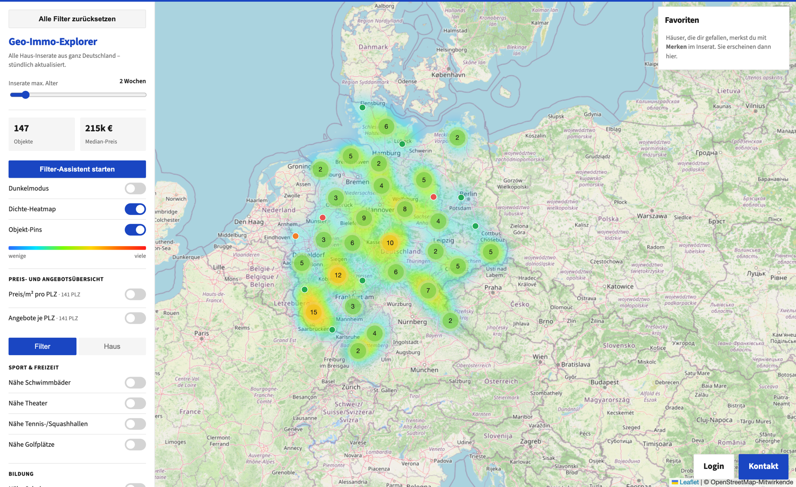
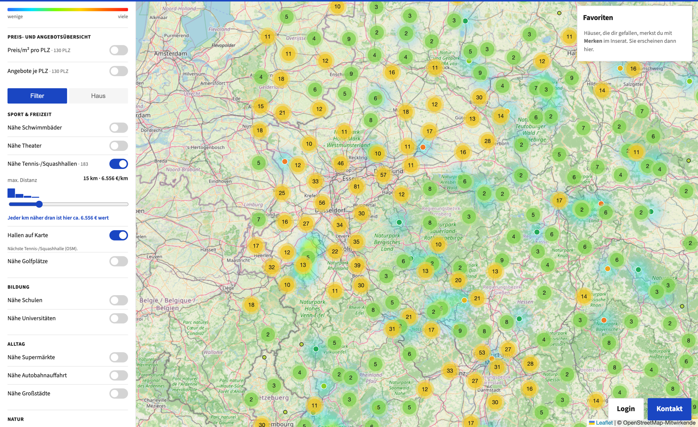
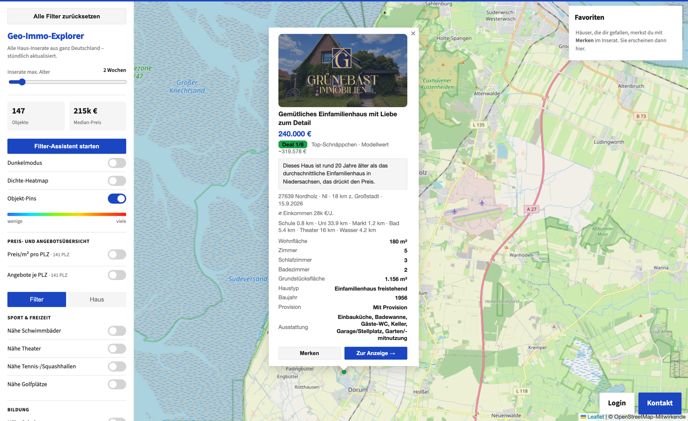
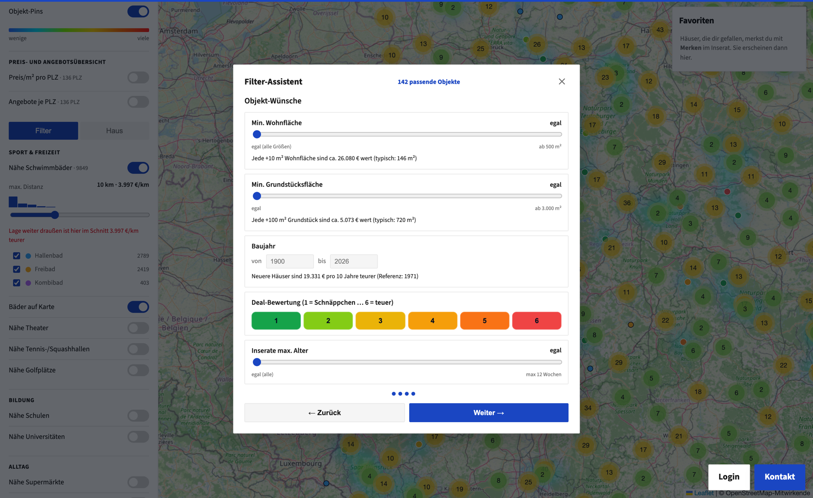
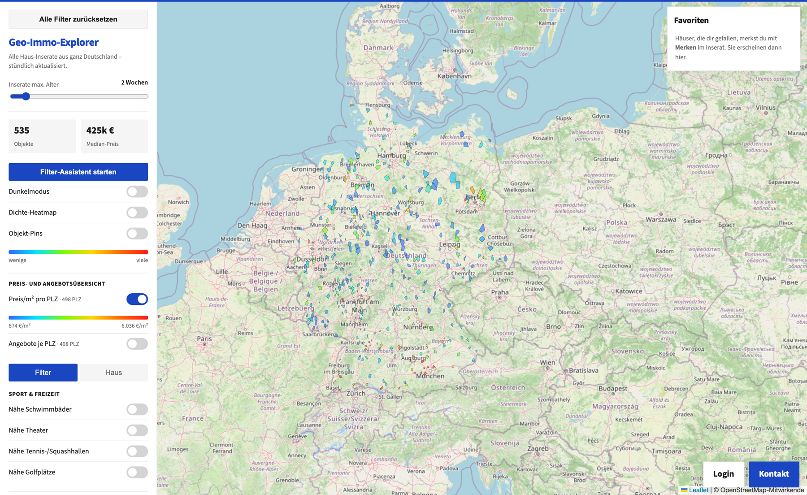
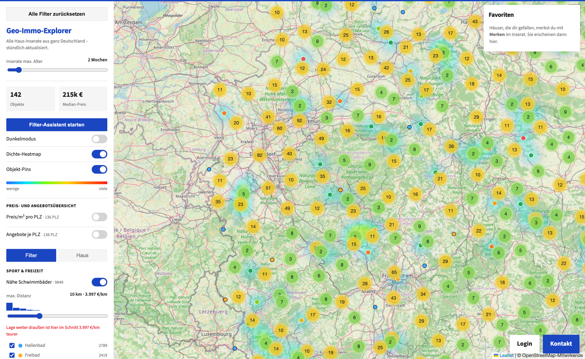
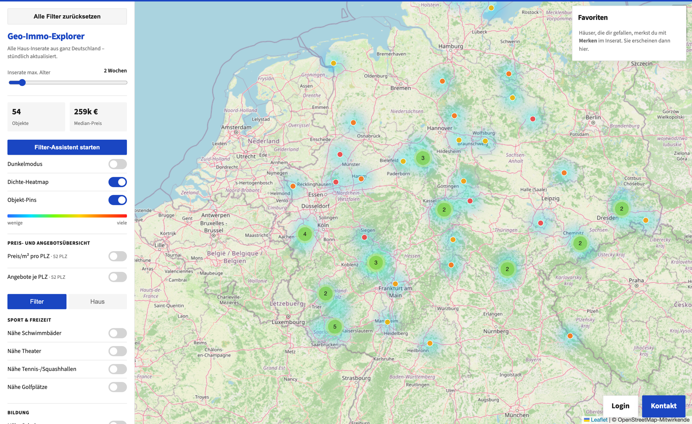

*Wie zwei strukturierte Datensätze, ein Scraper und ein KI-Agent mich das Haussuch-Tool bauen liess, das kleinanzeigen.de nie geliefert hat — in rund 5–8 Stunden, meistens auf dem Sofa.*

*Stand: September 2026. Alles Beschriebene läuft wirklich — die Zahlen und Screenshots in diesem Beitrag stammen aus meiner eigenen Instanz.*



## Die Prognose

Hier ist meine Wette für 2030: **das Jahr, in dem „eine App benutzen“ etwas Grundlegend anderes bedeutet als heute.**

Heute benutzen Sie und ich dasselbe Immobilienportal. Denselben Suchschlitz: Preis, Fläche, Zimmer. Denselben Listen-View, dieselbe Karte, denselben „Agent kontaktieren“-Button. Das Interface wurde von einem Produktteam in Berlin oder Hamburg entworfen — für den Median von Millionen Nutzern und, ehrlich gesagt, für maximalen Anzeigen-Umsatz und Lead-Verkauf.

Im Jahr 2030 wirkt das so veraltet wie gedruckte Zeitungs-Inserate. Was Sie stattdessen haben werden, ist **Ihr eigenes Interface**: generiert für Ihre Bedürfnisse, laufend auf Ihren Daten, ausgedrückt in genau den Fragen, die *Sie* haben. Kein mit einem Dunkelmodus-Schalter „personalisiertes“ UI. Ein Interface, das so persönlich ist wie Ihre Suchhistorie.

Und hier die zweite Hälfte der Wette — die eigentliche Pointe dieses Beitrags:

**Der schwierige Teil der KI wird 2030 nicht die KI sein. Es wird sein, ein solides, strukturiertes Datenfundament zu haben, auf das man die KI ansetzt.**

Die Modell-Layer rast auf Kommodisierung zu. Was eine magische Demo von einem nützlichen Produkt trennt, ist, ob strukturierte, sauber annotierte Daten dahinter existieren. Dieser Beitrag ist die Geschichte eines Wochenende-Projekts, das mich davon überzeugt hat — weil ich an einem Freitagabend etwas gebaut habe, das vorher schlicht unmöglich zu bauen war, und weil die einzigen zwei Zutaten, die zählten, zwei solide Datenfundamente und ein KI-Agent waren.

## Die Suche, die kein Portal beantworten kann

Ich suche ein Haus in Deutschland. Nicht im abstrakten „wäre nett“-Sinn — tatsächlich. Und meine Kriterien sind, wie sich herausstellt, auf keinem deutschen Immobilienportal suchbar:

- Ich spiele Squash. Ich würde gern **in der Nähe einer Tennis-/Squashhalle** wohnen.
- Ich schwimme gern. Ein **öffentliches Bad im Umkreis von ein paar Kilometern** wäre super.
- Zum **Supermarkt fahre ich lieber mit dem Velo** als mit dem Auto.
- **Theater** sollte in Reichweite sein.
- Und weil meine Arbeit mich manchmal auf die Autobahn bringt, zählt auch eine vernünftige Distanz zur nächsten **Auffahrt**.

Versuchen Sie, das bei Immowelt, ImmobilienScout24 oder kleinanzeigen.de zu suchen. Sie können nach „Balkon“ und „Baujahr ab 1990“ filtern. Sie können nicht nach „innerhalb von 10 km einer Halle für Indoorsport“ filtern. Diese Daten existieren im Schema nicht — weil das Schema um die Attribute gebaut ist, die *Verkäufer* in ein Formular tippen, nicht um das Leben, das *Käufer* tatsächlich leben.

Also habe ich mein eigenes Interface gebaut. Es heisst Geo-Immo-Explorer, es läuft auf [housing.ebermann.ch](https://housing.ebermann.ch/) — und, volle Transparenz, weil sich dieser Absatz verdient hat: **es scrapt kleinanzeigen.de und verletzt damit deren Nutzungsbedingungen.** Das ist eine private Demo der Möglichkeiten, kein Geschäft, und die Inserate gehören den jeweiligen Inserenten. In einer Welt, in der die Datenfundament-Frage ernst genommen würde, bräuchte ich den Scraper nicht: Das Portal würde mir einen eigenen Feed anbieten (eine API, einen MCP-Server, eine DWH-Anbindung — wählen Sie Ihr Jahrzehnt). Tat es nicht. Also Scraper. Es geht in diesem Beitrag nicht ums Scrapen. Es geht um das, was passiert, *nachdem* die Daten strukturiert waren.

## Zwei Fundamente

Das ganze System steht auf genau zwei Datensätzen. Beide sind langweilig. Beide sind strukturiert. Genau deshalb war das Interessante überhaupt möglich.

**Fundament 1: die Inserate.** Ein Scraper ruft jede Stunde die öffentliche kleinanzeigen.de-Suche auf, parst das Such-HTML und die Detailseiten und legt jedes Haus-Inserat in einer flachen JSON-Datei ab, geocodiert über die Postleitzahl. Rund 9'700 Inserate, Tendenz steigend. Das ist der Data Warehouse für Arme: kein CDC, kein Event-Streaming, nur eine Datei voller Zeilen mit Preis, Wohnfläche, Grundstück, Baujahr, Haustyp, Koordinaten. Strukturiert ist strukturiert.

**Fundament 2: OpenStreetMap.** Auf dieses Fundament will ich mich aufhalten, denn es ist der Beweis der These. OSM ist das am besten annotierte freie Geodaten-Fundament des Planeten, und es hat eine Query-API — [Overpass](https://wiki.openstreetmap.org/wiki/Overpass_API) — mit der man Fragen stellen kann wie „Gib mir jede Sporthalle in Deutschland, die für Tennis oder Squash getaggt ist“, und in Sekunden eine Antwort bekommt. Die Daten sind nicht nur *da*; sie sind *annotiert* (jedes Objekt trägt Tags wie `sport=tennis`, `leisure=sports_hall`), die Query-Sprache ist dokumentiert, und es gibt überall ausgearbeitete Beispiele. Ein KI-Agent spricht diesen Dialekt flüssig.

Hier ist die tatsächliche Query, die mein Agent für Tennis- und Squashhallen geschrieben hat (aus `scripts/build_tennis.py` im Repo):

```python
def tile_query(s, w, n, e):
    bbox = f"{s},{w},{n},{e}"
    return f"""
[out:json][timeout:120];
(
  nwr["sport"~"tennis|squash"]["leisure"~"sports_centre|sports_hall"]({bbox});
  nwr["sport"~"tennis|squash"]["indoor"="yes"]({bbox});
  nwr["sport"~"tennis|squash"]["building"]({bbox});
  nwr["sport"="squash"]({bbox});
);
out center;
"""
```

Beachten Sie, was das auf semantischer Ebene tut: Es ist nicht „finde Tennisplätze“ — Deutschland hat Tausende Freiluft-Plätze, die mich im Dezember nicht interessieren. Es geht um *Hallen*: die Kombination aus `sport` + `leisure=sports_hall`/`indoor=yes`/`building`, plus jedes `sport=squash` (Squash spielt man praktisch immer drinnen). Diese Präzision ist nur möglich, weil die Daten annotiert sind. Eine „Datenbank“ aus gescannten Karten wäre nutzlos gewesen. Strukturierte Tags machten daraus ein Feature für einen Nachmittag.

Eine ehrliche Ingenieurs-Fussnote, denn genau diese Details tauchen nur auf, wenn man das wirklich laufen lässt: Die öffentliche Overpass-Instanz bricht bei Deutschland-weiten Queries in der Zeit ab. Also legt das Skript das Land als Raster von Bounding Boxes gekachelt vor und dedupliziert auf einem ~55-m-Grid:



Der Screenshot oben ist das Ergebnis: **5'453 Tennis- und Squashhallen** in ganz Deutschland, und jedes Inserat kennt jetzt seine Distanz zur nächsten. Der Slider filtert — und das ist der Teil, zu dem ich gleich zurückkomme — die blaue Zeile darunter („Jeder km näher dran ist hier ca. 6.556 € wert“) ist eine *Preiseinschätzung Ihres eigenen Hobbys*, gerechnet von einem Modell, das ich gleich zeige.

Dasselbe Muster lieferte mir gratis:

- **9'849 öffentliche Bäder** (aufgeteilt in Hallenbad / Freibad / Kombibad — ein Freibad ist im Januar Dekoration)
- **3'104 Theater**, **35'013 Schulen**, **15'906 Supermärkte**
- **2'389 Autobahn-Auffahrten** — aber nur *echte*, dazu gleich mehr
- **28'816 See-/Meeres- und 12'470 Fluss-Punkte** für Wassermenschen
- 235 Sample-Punkte in deutschen **Erholungsregionen**

## Das Autobahn-Beispiel: Datenbereinigung als Domänenwissen

Der Autobahn-Datensatz ist mein Liebling, denn er zeigt, wo sich „die KI schreibt den Code“ und „der Mensch weiss, was er will“ treffen.

Der naive Weg — OSM nach `highway=motorway_junction` fragen — liefert für meinen Zweck Müll: beide Fahrbahnen jeder Anschlussstelle, die grossen Kreuze und Dreiecke, Raststätten, sogar höhenfreie Bundesstrassen-Knoten. Was ich wollte, war eine echte *Anschlussstelle*, eine benannte Auffahrt, an der man für einen Ort abbiegt. Die Lösung ist reine Domänen-Logik in `scripts/build_autobahn.py`:

```python
def germany_query():
    return (
        f"[out:json][timeout:180];"
        f'way["highway"="motorway"]["ref"~"{MOTORWAY_REF}"](area:{GERMANY_AREA});'
        f'node(w)["highway"="motorway_junction"];'
        f"out;"
    )
```

…wobei `MOTORWAY_REF = r"^A ?[0-9]"` nur Ways auf echten deutschen Autobahnen durchlässt (`A 8`, `A 81`) und ein Namensfilter die Nicht-Auffahrten auswirft:

```python
_KNOT = re.compile(r"\b(autobahn)?(kreuz|dreieck|gabelung)\b", re.I)
_RAST = re.compile(r"raststätte|rasthof|rastplatz|\bparkplatz\b|\bpwc\b", re.I)
```

Dann clustert ein kleiner Union-Find die beiden Richtungs-Knoten jeder Auffahrt zu einem Punkt. Ergebnis: **2'389 echte Anschlussstellen.** Ein KI-Agent hat 95% dieses Codes in Minuten geschrieben — aber *ich* musste wissen, dass „Kreuz Stuttgart“ nicht dort ist, wo man für Stuttgart abfährt. Strukturierte Daten ersparen nicht das Urteil; sie lassen Urteil erst im Massstab wirken.

## Power-User auf einem Niveau, das Portale nicht anbieten können

Sobald jedes Inserat rund 20 konstruierte Features trägt — Distanzen zu Bädern, Schulen, Supermärkten, Theatern, Gewässern, Tennishallen, Auffahrten, Erholungsregionen, dazu das Median-Einkommen des Kreises und die Energieklasse — verschiebt sich etwas. Sie hören auf, ein Betrachter von Fotos zu sein, und werden zum Analysten eines Marktes. Zwei kleine ML-Modelle haben die Erfahrung mehr verändert als alles andere zusammen.

### Modell 1: der Schnäppchen-Detektor (XGBoost)

Das erste Modell (`price_model.py`, gut tausend Zeilen inklusive Text-Features, Peer-Erklärungen und Klempnerarbeit) lernt aus dem ganzen Markt, was ein Haus *kosten sollte*: Wohnfläche, Grundstück, Zimmer, Baujahr, Haustyp, Energieklasse, Bundesland, Koordinaten und alle Distanz-Features von oben. Dann rankt es jedes Inserat danach, wie weit der Angebotspreis von seiner Vorhersage abweicht.

Das Implementierungs-Detail, das zählt, ist nicht das Gradient Boosting — es ist die **Ehrlichkeit**:

```python
def _oof_predict(X, y):
    """Out-of-fold log-price predictions for every row (no row scores itself)."""
    n = len(y)
    names = _feature_names()
    oof = np.full(n, np.nan)
    k = min(N_FOLDS, n)
    for train, test in _kfold_indices(n, k):
        dtrain = xgb.DMatrix(X[train], label=y[train], feature_names=names)
        dtest = xgb.DMatrix(X[test], feature_names=names)
        booster = xgb.train(XGB_PARAMS, dtrain, num_boost_round=N_ROUNDS)
        oof[test] = booster.predict(dtest)
    return oof

oof = _oof_predict(X, y)
deviation = y - oof   # <0 = unter dem erwarteten Preis (Schnäppchen), >0 = überteuert
levels = _levels_from_deviation(deviation)
```

Jedes Inserat wird von einem Modell bewertet, das es im Training nie gesehen hat (5-fach Out-of-fold-Prädiktion). Die Residuen werden in sechs gleich grosse Gruppen geteilt — Deal 1 (Top-Schnäppchen) bis Deal 6 (überteuert). Und die ehrlichen, kreuzvalidierten Zahlen, vom Server selbst gedruckt: **R² von 0.716 im Log-Raum, ein mittlerer absoluter Fehler von rund 102'000 €** auf 9'681 Inseraten. Der MAE klingt alarmierend, bis man sich erinnert, dass deutsche Hauspreise zwischen 80'000-€-Dörfern und München mit 12'000 €/m² spannen — das Modell rankt weit besser, als es preist, und Ranking ist alles, was ich brauche.



Dieses Popup ist der Power-User-Moment. „Deal 1/6 · Top-Schnäppchen · Modellwert ~319.578 €“ für ein Haus mit 240'000 € — und darunter auf Deutsch, *warum* es günstig ist: „Dieses Haus ist rund 20 Jahre älter als das durchschnittliche Einfamilienhaus in Niedersachsen, das drückt den Preis.“ Dazu, beachten Sie die Metadaten-Zeile, die Ihnen kein Portal zeigt: 18 km zur nächsten Grossstadt, durchschnittliches Lokaleinkommen 28k €/Jahr, Schule 0.8 km, Supermarkt 1.2 km, Bad 5.4 km, Wasser 4.2 km.

Würde eine kommerzielle Plattform das je bauen? Ein Deal-Filter, der Nutzern sagt „dieser Verkäufer verlangt weit unter Marktwert“, ist der Marktplatz-Logik fast *entgegen* gerichtet, die jedes Geschäft zu jedem Preis will. Comparis.ch in der Schweiz hatte so einen Preis-Check bekanntlich — und hat ihn wieder abgeschaltet. Auf dem eigenen Stack ist das ein Dienstagabend.

### Modell 2: der Preis-Erklärer (bewusst linear)

Das zweite Modell ist noch simpler — eine schlichte OLS-Regression auf den Log-Preis, gerechnet mit numpys `lstsq` — und es ist mein Lieblingsobjekt im ganzen Projekt:

```python
rows.append([1.0, log_w, log_g, year_c] + dists)
ys.append(math.log(pn))
...
coeffs, *_ = np.linalg.lstsq(X, y, rcond=None)
```

Log-Preis erklärt durch Log-Flächen, Baujahr, zwölf Distanzen und Bundesland-Dummies. Warum linear, wenn ich schon das schickere XGBoost habe? Weil dieses *erklärt*. Ein Koeffizient ist hier eine ceteris-paribus-Aussage: **„bei sonst gleich, verändert ein Kilometer mehr Abstand zu X den Preis um β.“** Der naive Vergleich („Häuser nahe am Bad kosten X, Häuser weit weg kosten Y“) ist hoffnungslos konfundiert — Häuser nahe am Bad sind meist nahe bei *Städten* — aber die Regression hält die Stadt fest. Aus dem aktuellen Lauf über 10'176 vollständig attribuierte Inserate (die Vereinigung der Basis-Scrapes mit neueren stündlichen Scrapes, daher ein paar hundert mehr als beim Scoring oben), Median-Angebotspreis 619'900 €:

| Feature (je km weiter weg) | Preiseffekt | Signifikanz |
|---|---|---|
| Supermarkt | **−9'287 €/km** | t = 5.5 |
| Tennis-/Squashhalle | **−6'556 €/km** | t = 9.8 |
| Theater | −3'942 €/km | t = 6.9 |
| Golfplatz | −2'398 €/km | t = 12.3 |
| Autobahn-Auffahrt | −1'550 €/km | t = 4.2 |
| Öffentliches Bad | **+3'997 €/km** | t = 3.7 |
| Erholungsregion | +1'889 €/km | t = 7.0 |

Lesen Sie die Tennis-Zeile noch einmal: Jeder Kilometer, den Sie *weiter weg* von einer Tennis-/Squashhalle wohnen, macht Häuser im Schnitt **6'556 € günstiger**. Der Hobby-Aufpreis ist real und in den deutschen Wohnungsmarkt eingepreist — reiche Leute haben auch ihre Hobbys, und sie zahlen für die Nähe. Der *positive* Bad-Koeffizient erzählt seine eigene Geschichte: Häuser nahe am öffentlichen Bad sind ceteris paribus *günstiger*, weil Bäder dort stehen, wo normale Menschen wohnen, nicht auf den schicken Hügeln. Selbst die Autobahn zeigt das erwartete Vorzeichen — jeder Kilometer mehr Distanz zur Auffahrt kostet rund 1'550 €.

Und weil es dasselbe Modell ist, kann ich meine eigene Position darin ablesen: +26'080 € je +10 m² Wohnfläche, +5'073 € je +100 m² Grundstück, +19'331 € je 10 Jahre neuer. Jeder Nähe-Slider im UI zeigt seinen persönlichen Wechselkurs live — Sie haben ihn oben unterm Tennis-Slider gesehen, hier im Filter-Assistenten:



Das ist strategische Suche: Ich kann beschliessen, dass mir eine 15-Minuten-längere Fahrt zum Bad genau 30'000 € wert ist — und entsprechend filtern. Kein Portal wird Ihnen je sagen, was Ihre Präferenzen kosten, denn deren Interface weiss nicht, dass Ihre Präferenzen existieren.

### Die Aggregate, die nur ein Datenfundament liefert

Mit dem Fundament im Rücken werden ganze-Deutschland-Fragen zu je einem Nachmittag:



Durchschnittspreis pro Quadratmeter für jede Postleitzahl-Zone des Landes (498 PLZ in der aktuellen Ansicht, clientseitig aus den Rohzeilen gerechnet). Wo ist das Leben günstig? Wo ist der Preisgradient steil? Solche Karten verkaufen Immobilienportale als bezahlte „Marktberichte“ — hier fällt sie in ~30 Zeilen JavaScript aus den Daten heraus.


Dieselben Daten, ein anderer Schnitt: **wie viele Häuser überhaupt im Angebot sind** pro Zone. Regionen mit hohem Angebot heissen Auswahl und Verhandlungsmacht; drei Inserate in einer PLZ heissen, der Verkäufer besitzt den Preis. Für Airbnb-Interessierte ist die Kreuzung dieser Ebene mit der Erholungsregionen-Ebene genau die Analyse „wo könnte eine Ferienwohnung überhaupt konkurrieren?“ — und ja, der naheliegende nächste Schritt wäre, Airbnb-Beliebtheit auf dieselbe Art zu scrapen und Nachfrage statt nur Angebot zu bekommen.

Und die Nähe-Filter verbinden die beiden Fundamente direkt auf der Karte — Bäder im Umkreis von 10 km, mit den OSM-Objekten als Pins und dem €/km-Wechselkurs der Region direkt unterm Slider:





## Die Zeitrechnung ist die eigentliche Geschichte

Ich will echte Zahlen zum Aufwand nennen, denn hier hört die 2030-These auf, abstrakt zu sein.

Das war nicht mein Job. Es war ein Nebenprojekt, gebaut in grob **5–8 Stunden über eine Handvoll Abende — vibecoded mit einem KI-Agenten, oft während im Hintergrund eine Serie lief.** Scraper, Geocoder, Tile-Server, Leaflet-Frontend, Accounts mit Favoriten und Presets, E-Mail-Alerts, zwei ML-Modelle, ein Dutzend OSM-Datensätze. In den Before-Times — ich habe diese Zeiten gelebt — ist das ein gescopetes Projekt: ein kleines Team, ein bis zwei Monate 9-to-5, Sprints, Standups und ein Jira-Board.

Was hat die Stunden tatsächlich gefressen? Nicht das Schreiben des Codes. Der Agent schreibt den Code schneller, als ich ihn lesen kann. Die Stunden flossen ins *Denken*: Was genau ist eine Autobahn-Anschlussstelle, welche OSM-Tags bedeuten „Halle“, warum der naive Preisvergleich lügt, was ein Deal-Level bedeutet. Urteilsarbeit, nicht Tipparbeit. Und jede einzelne dieser Stunden wurde **auf strukturierten Daten** verbracht. Niemand — Mensch oder KI — hätte sich durch „die Bad-Standorte existieren nur als Prosa-Liste“ oder „die OSM-Tags sind inkonsistent“ vibecoden können. Das Tempo kam nicht vom Modell. Das Tempo kam daher, dass wir auf zwei Fundamenten standen, die schon solide waren: OSMs annotierte Tags und dokumentierte API auf der einen Seite, ein strukturierter Scrape (der in Wahrheit ein MCP-Server oder eine ordentliche Warehouse-Anbindung sein sollte) auf der anderen.

Das ist das ganze Argument in einem Satz: **KI ist ein Kraftmultiplikator auf Datenstruktur.** Null mit irgendetwas multipliziert bleibt null.

## Was ich dem Produktteam von 2030 sagen würde

Drei Dinge, falls Sie irgendwas bauen:

1. **Das Interface wird persönlich, und das ist in Ordnung.** Mein UI hat t-Statistiken und Choroplethen, weil ich Data Scientist bin und das will. Meine Partnerin will Fotos, Karten und Vibes — und das ist ein gleichwertiges Interface über dasselbe Fundament. 2030 bekommen wir beide unseres. Niemand wird noch ein UI für Millionen Menschen shippen und es „nutzerzentriert“ nennen.
2. **Der Burggraben wandert zu den Daten.** Wenn Sie ein Portal betreiben: Ihre Verteidigbarkeit ist nicht Ihr Suchformular — sie ist die Frage, ob Sie Ihren Nutzern eigene Agenten an saubere, strukturierte, *abfragbare* Daten lassen. Firmen, die ihre Daten öffnen (APIs, MCP-Server, Warehouse-Lesezugriff), überleben als *Orte, an denen Daten leben*, statt als Ort, an dem zufällig ein festes UI steht. Ich würde für eine kleinanzeigen-API bezahlen, die meinen Scraper überflüssig macht. Der Scraper existiert, weil die Tür verschlossen ist.
3. **Für Einzelpersonen: Ihre Fragen sind legal; nur die Daten sind weggesperrt.** Nichts an meinen Suchkriterien ist exotisch. Millionen Menschen haben genauso spezifische. Die Werkzeuge, sie zu beantworten, kosten jetzt Sofa-und-Serien-Preis. Was fehlt, ist der Datenzugang.

## Das ehrliche Kleingedruckte

Weil eine so aufregende Demo eine Kaltdusche verdient:

- **Die TOS-Verletzung ist real.** Scrapen bricht die Nutzungsbedingungen von kleinanzeigen.de; das ist eine private, nicht-kommerzielle Demo, und ich bin rücksichtsvoll (stündlich, paginiert, gecached). In einem besseren Daten-Ökosystem würde dieser Absatz nicht existieren.
- **Angebotspreise sind nicht Kaufpreise.** Die Modelle sehen *Angebote*, nicht notariell beurkundete Verkäufe. Überteuerte Inserate, die monatelang unverkauft hungieren, verzerren jeden Schnäppchen-Detektor; ein Deal 1 ist „günstig *für den Markt der Angebotspreise*“, kein garantierter Fang.
- **Der 102'000-€-MAE ist auch real.** Das Modell rankt; es schätzt nicht. Machen Sie nie ein Angebot, weil ein Gradient-Boosted-Tree etwas gefühlt hat.
- **Scrapes verrotten.** kleinanzeigen hat mitten im Projekt ein Redesign ausgeliefert, und der Listen-Parser war über Nacht kaputt (die Git-History beweist es — Commit „Behebt den Listen-Parser für die neue kleinanzeigen-Suchseite“). Zerbrechlichkeit ist die Steuer auf geschlossene Daten.
- **OSM-Vollständigkeit variiert.** 5'453 Tennishallen sind wahrscheinlich ein guter Teil der wahren Zahl; die Theater-Dichte auf dem Land ist sicher unterkartiert. Die Distanz zum „nächsten Theater“ in einer dünnen Region ist eine Obergrenze.
- Alle Kartendaten © [OpenStreetMap contributors](https://www.openstreetmap.org/copyright), abgerufen über die öffentliche Overpass-API (seien Sie rücksichtsvoll damit, und wer hochskaliert, schaut sich [Geofabriks Deutschland-Extrakt](https://download.geofabrik.de/europe/germany.html) an). Inserate-Daten gehören kleinanzeigen.de und den Inserenten.

---

*Das Projekt liegt auf [github.com/plotti/kleinanzeigen](https://github.com/plotti/kleinanzeigen) — Scraper, Modelle und Frontend sind alle da. Die Live-Instanz läuft auf [housing.ebermann.ch](https://housing.ebermann.ch/). Gebaut mit einem KI-Agenten (Claude Code), Python 3.12, XGBoost, numpy, Leaflet, OpenStreetMap + Overpass, GeoNames — und ungefähr einer Staffel einer Netflix-Serie.*
