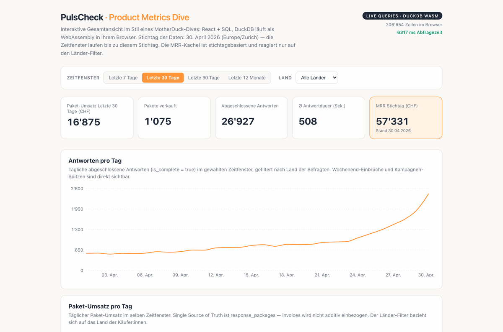

**Stand:** September 2026 · **Autor:** Thomas Ebermann · **Lesedauer:** ca. 14 Minuten

## TL;DR

In meinem [letzten Beitrag](/blog/agentic-dashboards-mit-evidence/) habe ich gezeigt, wie Sie mit Evidence, DuckDB und Claude Dashboards als Code bauen – open source, mit Hosting Kosten die nahe null sind und versioniert wie Software. Und ich habe dort eine Schwäche eingeräumt, die ich heute zum Hauptthema mache: **Ein Evidence-Dashboard ist eben leider nur so aktuell wie sein letzter Deploy.** Es ist statisch, und wird nicht aktualisiert.

Genau hier setzen [MotherDuck Dives](https://motherduck.com/product/dives/) an: Dives sind auch in Code geschreibene Dashboards, deren Queries beim Öffnen **live** gegen die Datenbank laufen und deren Facettierung dann im Browser des Anwenders in Millisekunden rechnet. Dieser Beitrag erklärt den Architektur-Unterschied zwischen den beiden Dashboard und rechnet durch, was Dives kosten (ja, ein Abo braucht es – aber kein Per-Seat-Modell), und sagt ehrlich, wann ich welches Werkzeug einsetzen würde.

## Die eine Schwäche, die mein Evidence-Setup hat

Zur Erinnerung, wie das Evidence-Setup aus dem letzten Beitrag funktioniert: Ein Dashboard ist eine Markdown-Datei mit SQL-Blöcken. Beim `npm run build` läuft jede Query **einmalig** gegen die Datenquelle, die Resultate landen als Parquet-Dateien in der statischen Site, und der Browser zeigt diese vorkompilierten Daten an. Die [Deployment-Doku von Evidence](https://docs.evidence.dev/deployment/overview) sagt es auch ganz direkt: Die Daten werden nur dann aktuell, wenn man sie **neu baut**. Evidence ist im Grunde ein Static-Site-Generator. Das hat natürlich auch manchmal Vorteile: In der Vorstandssitzung will niemand die Zahl, die sich zwischen Folie 3 und Folie 7 ändert. Und mit Build-Crons (nightly, wöchentlich) ist der Datenstand praktisch gut genug.

Aber es hat eban auch Nachteile:

- **Alt sein vermeiden.** Zwischen Build und Öffnen liegen Stunden bis Tage. Wer um 16:47 wissen will, was heute Morgen verkauft wurde, schaut dann in die Röhre.
- **Frei drillen.** Die Filter, die ich eingebaut habe, funktionieren – aber sie rechnen nur auf der eingefrorenen Datenmenge umher. Eine neue Schnitt-Dimension (etwa «Umsatz nach Kanton statt Land») ist ein dann eben Code-Change plus Build und kein Klick. Das kann als nervig empfunden werden.
- **Wachsen mit der Frage.** Jede neue Frage der Geschäftsleitung landet erst im Chat-Verlauf (z.B. beim [nao-Agent](/blog/agentic-bi-für-kmu-in-der-praxis_-ein-schweizer-saas-fall-mit-nao/)) und wird erst beim nächsten Build zum Dashboard. 

## Was Dives anders machen: Build-Zeit vs. Lauf-Zeit

Die Architektur unterscheidet sich also bei beiden Dashboards:

**Evidence (Build-Zeit):** Hier läuft die Query Build, das Resultat wird dann eingefroren. Jeder Seitenaufruf zeigt dann dasselbe eingefrorene Resultat. Die Daten sind dann eben so frisch wie der letzte Deploy.

**Dive (Lauf-Zeit):** Beim Öffnen des Dives laufen die Queries **live** auf dem MotherDuck-Compute gegen den aktuellen Stand des Warehouse. Die Resultate werden in eine DuckDB-Instanz im Browser gestreamt – DuckDB als WebAssembly, dieselbe Engine, die wir lokal lieben, nur eben in der Browser-Sandbox. **Die Facettierung läuft danach lokal.** d.h. das Zeitfenster wechseln, Land filtern, in einen Bereich hineinzoomen – alles rechnet gegen den frisch geladenen Datensatz im eigenen Browser, in einstelligen Millisekunden, ohne einen einzigen Roundtrip zur Datenbank. Das ist schon recht cool.

Das Ergebnis dieser Zweiteilung ist bemerkenswert: Das Dashboard ist beim Öffnen **nie stale** (Datenabruf live), aber die Interaktion kostet **trotzdem kein Warehouse-Compute pro Klick** (Facettierung lokal). MotherDuck nennt das [Dual Execution](https://motherduck.com/product/dives/), und in meinen eigenen Tests mit rund 200'000 Zeilen bleibt ein kompletter Filter-Durchlauf unter 20 Millisekunden – dazu unten mehr. Das alles hat auch einen Preis, und der ist nicht nur der Abo-Betrag:

- **Compute bei jedem Öffnen.** Ein statisches Evidence-Dashboard kostet pro View exakt nichts. Ein Dive verbraucht Warehouse-Compute, sobald jemand es öffnet. Im Gratis-Plan sind das 10 Compute-Stunden pro Monat – für ein internes Dashboard reicht das, für 500 Kunden-Embeddings natürlich nicht (dazu gleich).
- **Die Zahlen verändern sich unter Ihren Füssen.** Der Vorstand sieht 09:00 einen Wert, um 11:00 einen anderen. Reproduzierbarkeit muss man sich bei Live-Daten anders sichern – etwa mit fixen Stichtagen *in* den Queries.
- **Daten liegen in der Cloud.** Ein Dive zeigt nur, was im MotherDuck-Warehouse liegt. Wer On-Prem-Pflicht hat, für den ist die Diskussion hier zu Ende – Evidence auf eigener Infrastruktur ist dann wieder attraktiv.

Auch Evidence selbst hat die Konvergenz Richtung Live längst vollzogen. Auf der [Homepage](https://evidence.dev) verkauft die Firma inzwischen einen Analytics Agent (live im Chat, per Slack und MCP) und eine Embedded-Analytics-API.

## Was ein Dive überhaupt ist

Kurz zum Produkt selbst, weil die Bedeutung im Hype untergeht: Ein Dive ist eine interaktive Data App, bestehend aus **React und SQL**. Kein proprietäres JSON-Chart-Format wie bei klassischem BI, sondern ein React-File mit eingebetteten, auditierbaren SQL-Queries. Versionierbar in Git, reviewbar per Pull Request, deploybar mit CI. Das ist exakt die «BI-as-Code»-Philosophie aus meinem Evidence-Beitrag, nur mit mehr Interaktivität unter der Haube.

Der Bauablauf ist agentenbasiert: Über den MotherDuck MCP Server sagt man dem Agenten der Wahl (Claude Code, ChatGPT, Cursor), was man sehen will, iteriert in natürlicher Sprache («Ersetze die Pie-Charts durch Sparklines») und publiziert den Dive in den Workspace. Wichtig für Skeptiker: Der Agent generiert den Code **einmalig** – was dann läuft, ist deterministische Web-App-Software mit nachvollziehbaren Queries, kein LLM, das bei jedem Seitenaufruf neu fantasiiert. Die Charts laufen standardmässig auf Recharts, D3 ist inklusive, und Libraries werden ins Sandbox-Bundle gepackt statt live aus dem Internet nachgeladen – verständlich, wenn die App mit einer Warehouse-Verbindung im Browser hantiert.

Zwei Einordnungspunkte noch:

- **Embedding.** Dives lassen sich als gesandboxtes iframe in die eigene App einbetten. Das eigene Backend hält den Admin-Token und stellt pro Session einen kurzlebigen Token aus – danach redet der Browser direkt mit MotherDuck, ohne Middleware-Server dazwischen. Kein eigenes Charting-Frontend, das man pflegt, und (siehe unten) keine Per-Viewer-Lizenz.
- **React.** In der [Dive Gallery](https://motherduck.com/dive-gallery/) finden Sie Beispiele, die kein Click-and-Drag-BI-Tool abbilden würde: ein Pivot-Explorer mit einem im Dive generierten Semantic Model in Malloy, oder ein interaktiver Globus, über den man Erdbeben zeitlich scrubt und Regionen cross-filtert. Das schöne daran: Es gibt keine Werkzeug-Grenze, eher nur eine Aufwandsgrenze. Das weniger schöne: Der Aufwand, ein eigenes React-App-Design zu pflegen, ist eben auch nicht null – wobei sich der Agent darum kümmern soll, nicht Sie. 

## Was es kostet: ja, ein Abo braucht es – aber kein Per-Seat-Modell

Dives sind kein Open Source. Das Feature hängt an MotherDucks Infrastruktur (serverseitigem Compute und Storage); mit reinem OSS-DuckDB ist es nicht abbildbar – das WASM-Teil schon, dazu unten. Die aktuelle [Preisliste](https://motherduck.com/pricing/):

| Plan | Preis | Was drin ist |
|---|---|---|
| **Lite** | **0 CHF** | 10 GB Storage, 10 Compute-Stunden/Monat, 3 interne User. **Dives für interne Dashboards inklusive.** |
| **Business** | **ab USD 250/Org./Monat + Usage** | 10 interne User, Storage 0.04 USD/GB, Compute ab 0.60 USD/Stunde. **Embedded Dives** (für Ihre eigene App) laufen ab hier bzw. Enterprise. |
| **Enterprise** | individuell | Unbeschränkte User, PrivateLink, Fixpreis-Kapazität. |

Das Wichtigste ist im Modell dass es **keine Per-Seat-Lizenzen.** hat. Klassisches Embedded-BI rechnet pro Viewer ab d.h. wenn Ihre App wächst oder Sie viele Kleinkunden haben, explodiert die Rechnung. Bei MotherDuck zahlen Sie Compute und Storage, und der Browser des Anwenders erledigt die Interaktion auf eigener Hardware, gratis. Für den Einstieg reicht die Gratis-Testphase (ohne Kreditkarte), Startups kriegen [motherduck.com/startups](https://motherduck.com/startups/) gratis Credits. Und für alle, die Dives für mehrere Kunden bauen: pro Kunde einen eigenen MotherDuck-User mit gleich benannter Database – serverseitig wird pro User isoliert gerechnet, und da die Plattform serverless ist, kostet ein stiller Kunden-Account nichts.

## Selbst ausprobieren: ein Dive im Eigenbau

Theorie ist schön, aber funktioniert das auch? Ich wollte es wissen und habe das Dive-Prinzip lokal nachgebaut: dieselben PulsCheck-Demodaten wie im Evidence-Beitrag (rund 200'000 Zeilen über 5 Tabellen), diesmal als React-App mit DuckDB-WASM im Browser. Das Herzstück ist eine einzige Datei mit sämtlichen Queries – auditierbar, versionierbar, exakt die Dive-Philosophie:

```sql
-- src/queries.js (Auszug): KPIs im gewählten Zeitfenster
select
  (select round(sum(p.price_chf), 2)
     from pulscheck.response_packages p
     join pulscheck.customers c on c.id = p.customer_id
     where cast(p.purchased_at as timestamp)
             >= timestamp '2026-05-01' - to_days(${days})
       and ${ownerCountry(country)}) as window_revenue_chf,
  ...
```

Das UI: Zeitfenster-Umschalter (7/30/90/365 Tage), Länder-Filter, fünf KPI-Kacheln, Zeitreihen-Charts (Recharts, wie bei Dives üblich), klickbare Paketgrössen-Chips als Cross-Filter, Geo- und Top-Kunden-Sichten.  



**Alle 9 Queries in 15 Millisekunden** – nach dem ersten Laden. Zeitfenster umschalten, Land filtern, Chip klicken: alles rechnet lokal im Browser, ohne Roundtrip.

**Der Eigenbau ist inzwischen live** – und läuft tatsächlich mit echten MotherDuck-Daten: **[pulscheck-dive.fly.dev](https://pulscheck-dive.fly.dev/)**. Was sich gegenüber der Parquet-Version geändert hat – und was das über die Architektur aussagt:

Der Browser verbindet sich beim Öffnen via `@motherduck/wasm-client` direkt mit dem MotherDuck-Workspace. Die 9 initialen Queries laufen gegen das Live-Warehouse (Compute auf MotherDucks Seite), das Resultat wird in die Browser-WASM-Engine gestreamt. Danach – jeder Filterwechsel, jeder Chip-Klick – rechnet wieder lokal in einstelligen Millisekunden. Das ist exakt das Dual-Execution-Prinzip, nur selbst zusammengesteckt statt aus der Dive-Plattform.

Das Token-Management ist bewusst einfach gehalten: Ein langlebiger PAT liegt als Fly.io-Secret, ein kleines Entrypoint-Script schreibt ihn beim Container-Start als `window.MOTHERDUCK_TOKEN` in eine statische `config.js`, die die React-App beim Laden einliest. Kein eigenes Backend, keine Middleware. Für interne Tools – wo man den Token nicht vor dem eigenen Team verstecken muss – reicht das. Für Kunden-Embedding bräuchte man das Token-Refresh-Modell von MotherDuck, das kurzlebige Tokens serverseitig ausstellt.

**Was der Eigenbau zeigt:** Die Interaktions-Architektur ist keine Magie, sondern rund 300 Zeilen eigener Code. Was er *nicht* zeigt: den Workspace, den Agenten-Builder, die Dive Gallery, das polierte Embedding-SDK. Dafür zahlt man bei MotherDuck – nicht für den WASM-Teil, der ist DuckDB und damit quelloffen.

**Und weil man ja nie ohne Stolperstein davonkommt:** Der erste Render crashte mit `TypeError: can't convert BigInt to number`. Ursache: DuckDB liefert `count(*)`-Resultate über Apache Arrow als BigInt, und mein Zahlenformatter rief `isNaN()` darauf an – was bei BigInt eine Exception wirft. Zwei Zeilen Normalisierung an der Arrow-Grenze später lief alles. (Stellt sich übrigens die Frage, warum ein 14-Minuten-Beitrag über Dashboards-als-Code nicht auf den 15-Milliardsten-Bug in der Numerik-Serialisierung hinweisen kann. Nun – jetzt tut er es. :))

Der für mich wichtigste Befund: **Die Zahlen sind deckungsgleich mit der Evidence-Version.** 26'927 abgeschlossene Antworten im April, 16'875 CHF Paket-Umsatz, 57'331 CHF MRR zum Stichtag – beide Implementierungen, dieselben Queries in der Logik, identisches Resultat. Das ist die eigentliche Message: Es ist egal, ob Evidence, Dive oder eigenes React-Frontend – wer ein sauberes Query-Set und klare Geschäftsregeln hat (bei uns die RULES.md), kann das Frontend austauschen wie eine Jacke.

## Dives vs. Evidence: die ehrliche Matrix

| | **Evidence** (Open Source) | **MotherDuck Dives** |
|---|---|---|
| **Datenstand beim Öffnen** | Build-Zeit – stale bis zum nächsten Build | Live beim Öffnen; Facettierung danach lokal im Browser |
| Lizenzkosten | 0 CHF | Lite gratis, für Embedded USD 250+/Monat |
| Compute pro View | keiner | Warehouse-Compute bei jedem Öffnen |
| Daten liegen | bei Ihnen (z. B. DuckDB-File) | bei MotherDuck (Cloud-Warehouse) |
| Reproduzierbarkeit | fixer Snapshot pro Build (Feature!) | muss in den Queries gesichert werden (fixe Stichtage) |
| Interaktivität | gebaute Filter auf eingefrorenen Daten | freie Exploration, einstellige Millisekunden |
| Embedded Analytics | Eigenbau bzw. Evidence-Embedded-API | iframe mit kurzlebigem Token, Backend hält nur den Admin-Token |
| Vendor Lock-in | keins | vorhanden (Feature an MotherDuck gebunden) |
| Baustil | Markdown + SQL, Agent generiert | React + SQL, Agent generiert |

Aus meiner Sicht ist die erste Zeile die einzige, die eine Kaufentscheidung wirklich trägt. Alle anderen Zeilen sind entweder Folgen der ersten (Compute pro View gibt es nur, weil live geöffnet wird) oder Details, die beide Werkzeuge ähnlich gut lösen.

## Wann was?

Meine Arbeitshypothese nach dem zweiten Bau-Durchlauf:

- **Kuratierte interne Reports mit fixen Stichtagen, Kosten nahe null, Daten bleiben im Haus:** Evidence. Bleibt meine Open-Source-Antwort für das klassische Reporting-KMU – die Reproduzierbarkeit ist dort ein Feature, kein Bug.
- **Interne Exploration, wenn die Frage beim Build noch nicht bekannt war:** Dives im Lite-Plan ausprobieren – gratis, und das WASM-Gefühl muss man einmal erlebt haben, um zu verstehen, was ich meine.
- **Kunden-facing Analytics im eigenen Produkt:** Hier hat Dives für mich das beste Gesamtkonzept – iframe-Embed mit kurzlebigen Tokens, kein Per-Seat, keine eigene Charting-Wartung. Voraussetzungen: Die Daten dürfen ins MotherDuck-Warehouse, und ein Business-Abo ist eingeplant. Die Alternative aus dem Evidence-Lager (Embedded-API) ist einen Blick wert, relativ jung ebenfalls.
- **Regulatorisch kritische Daten, die die Firma nicht verlassen dürfen:** Beide Cloud-Optionen fallen aus. Evidence on-prem bleibt die entspannteste Antwort.

## Fazit: Das Foto und der Live-Stream

Drei Erkenntnisse zum Mitnehmen:

Erstens: **Die Datentabelle ist nicht das Dashboard.** Meine Evidence-Dashboards und mein Eigenbau-Dive teilen sich dasselbe SQL, dieselben Geschäftsregeln, dieselben Zahlen – was sie unterscheidet, ist ausschliesslich, *wann* die Queries laufen. Build-Zeit heisst reproduzierbar und gratis, Lauf-Zeit heisst aktuell und interaktiv. Wählen Sie bewusst, nicht aus Gewohnheit.

Zweitens: **React + SQL ist das Markdown des Dashboards.** Beide Tools bestätigen denselben Trend: Dashboards sind Code, Agenten schreiben den Code, Menschen reviewen ihn. Was sich ändert, ist nur das Ausführungsmodell – statischer Build hier, Browser-WASM mit Live-Datenabruf dort.

Drittens: **Der Context Stack bleibt der eigentliche Hebel.** Ob Evidence oder Dive – die Qualität des Resultats hing bei uns nie vom Charting-Tool ab, sondern von der RULES.md, dem Datenmodell und dem Realitätscheck gegen die echte Datenbank. Der kann in eine Dive genauso einziehen wie in eine Evidence-Pipeline.

Was kommt als Nächstes? Ich vermute, dass die Foto-gegen-Live-Stream-Frage sich in zwölf Monaten erledigt haben wird – in beide Richtungen. Statische Generatoren lernen Live-Komponenten, Live-Tools lernen Snapshots, und wir diskutieren dann über andere Dinge. Bis dahin: Probieren Sie den Lite-Plan aus (ohne Kreditkarte), und wenn Sie es ganz ohne Abo wollen – das Eigenbau-Muster oben passt in einen Nachmittag.

Ich freue mich auf Ihre Kommentare und Anregungen!

---

## Quellen und weiterführende Ressourcen

**Diese Blog-Serie:**

- [Agentic BI für KMU in der Praxis: Ein Schweizer SaaS-Fall mit nao](/blog/agentic-bi-für-kmu-in-der-praxis_-ein-schweizer-saas-fall-mit-nao/) – der Context-Stack-Anfang
- [The unreasonable effectiveness of Agentic Dashboards](/blog/agentic-dashboards-mit-evidence/) – Evidence, DuckDB und Claude, der Vorgänger-Beitrag

**MotherDuck Dives:**

- [Dives Product Page](https://motherduck.com/product/dives/) – Überblick, Live-Dive, Dual-Execution-Beschreibung, FAQ
- [Dive Gallery](https://motherduck.com/dive-gallery/) – Community-Dives zum Hineinkopieren
- [MotherDuck Pricing](https://motherduck.com/pricing/) – Pläne, Limits, Compute-Preise (Stand September 2026)
- [MotherDuck for Startups](https://motherduck.com/startups/) – Credits-Programm

**Evidence:**

- [evidence.dev](https://evidence.dev) – Product-Überblick (inkl. Analytics Agent und Embedded-API)
- [Evidence Deployment-Doku](https://docs.evidence.dev/deployment/overview) – Datenaktualisierung via Build

**Technischer Hintergrund:**

- [DuckDB](https://duckdb.org/) und [DuckDB-WASM](https://duckdb.org/2021/10/29/duckdb-wasm.html) – die in-process Engine, auch als WebAssembly im Browser
- [Recharts](https://recharts.org/) – die React-Charting-Library, die auch Dives defaultmässig nutzen

---

*Dieser Beitrag basiert auf einem eigenständigen Nachbau mit synthetischen Demodaten (die PulsCheck AG ist – wie im [Vorgänger-Beitrag](/blog/agentic-dashboards-mit-evidence/) beschrieben – ein zusammengesetztes Beispiel). Die Datapeople-Datenredaktion arbeitet mit Schweizer KMU an Datenarchitektur und Analytics. Feedback an [hello@datapeople.ch](mailto:hello@datapeople.ch).*
